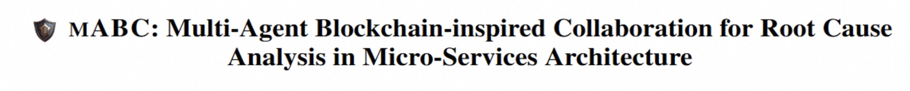
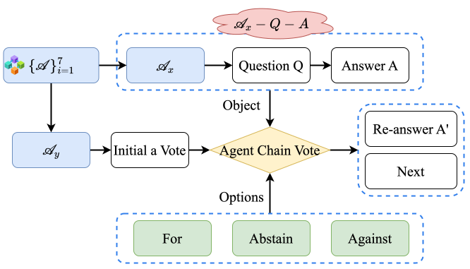
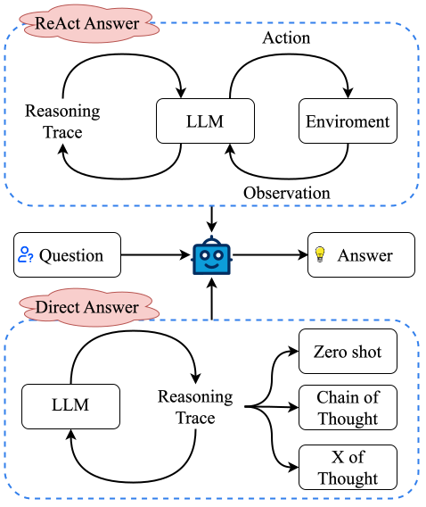
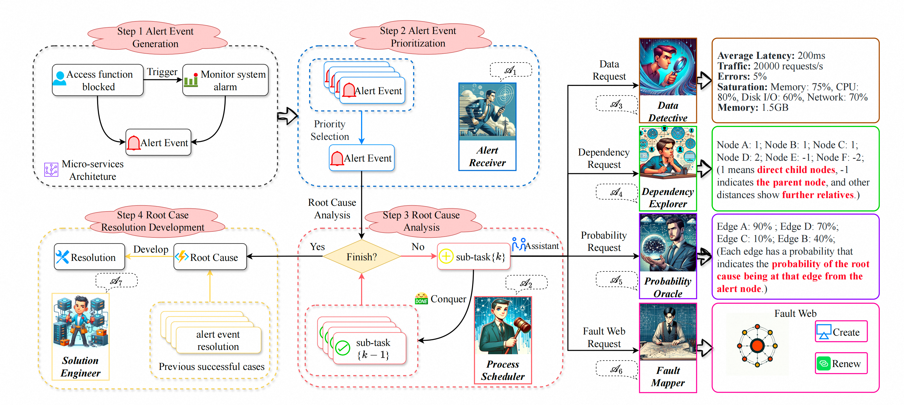

<div align= "center">
    <h1>  mABC</h1>
</div>

## Notice
Attention! We have provided a sample data file saved in the `simple_sample` folder so that you can process your data into a similar format to enjoy **mABC**!

We will release more data in this repository as soon as possible. Here is init version code and wait for our data to be updated after passing policy review. 

## Abstract
The escalating complexity of micro-services architecture in cloud-native technologies poses significant challenges for maintaining system stability and efficiency. To conduct root cause analysis (RCA) and resolution of alert events, we propose a pioneering framework, **m**ulti-**A**gent **B**lockchain-inspired **C**ollaboration for root cause analysis in micro-services architecture (**mABC**), to revolutionize the AI for IT operations (AIOps) domain, where multiple agents based on the powerful large language models (LLMs) perform blockchain-inspired voting to reach a final agreement following a standardized process for processing tasks and queries provided by *Agent Workflow*. Specifically, seven specialized agents derived from *Agent Workflow* each provide valuable insights towards root cause analysis based on their expertise and the intrinsic software knowledge of LLMs collaborating within a decentralized chain. To avoid potential instability issues in LLMs and fully leverage the transparent and egalitarian advantages inherent in a decentralized structure, mABC adopts a decision-making process inspired by blockchain governance principles while considering the contribution index and expertise index of each agent. Experimental results on the public benchmark AIOps challenge dataset and our created train-ticket dataset demonstrate superior performance in accurately identifying root causes and formulating effective solutions, compared to previous strong baselines. The ablation study further highlights the significance of each component within mABC, with *Agent Workflow*, multi-agent, and blockchain-inspired voting being crucial for achieving optimal performance. mABC offers a comprehensive automated root cause analysis and resolution in micro-services architecture and achieves a significant improvement in the AIOps domain compared to existing baselines.


## Overview
<center>
    
    <br>
    <div style="color:orange; border-bottom: 1px solid #d9d9d9;
    display: inline-block;
    color: #999;
    padding: 2px;"></div>
</center>
<!-- 

 -->

<center>
    
    <br>
    <div style="color:orange; border-bottom: 1px solid #d9d9d9;
    display: inline-block;
    color: #999;
    padding: 2px;">Overview of mABC. Overall pipeline encapsulates the flow from alert inception to root cause analysis within mABC.</div>
</center>

<center>
    
    <br>
    <div style="color:orange; border-bottom: 1px solid #d9d9d9;
    display: inline-block;
    color: #999;
    padding: 2px;">Two distinct workflows of agent. ReAct answer involves an iterative cycle of thought, action, and observation until a satisfactory answer is reached, while responses are directly formulated based on the prompt provided following the direct answer.</div>
</center>

<center>
    
    <br>
    <div style="color:orange; border-bottom: 1px solid #d9d9d9;
    display: inline-block;
    color: #999;
    padding: 2px;">Vote process on Agent Chain</div>
</center>

## Enviornment and Running

### Driven by OpenAI Version

1. python enviornment:

```
pip install -r requirements.txt
```

2. define your OPENAI_API_KEY and task.

```
export OPENAI_API_KEY="sk-xxx"
```

3. run script follow your task, example:

```
python main/main.py
```

### Driven by Alternative LLM Version

Try to replace `utils/llm.py`.


## Notice
Feel free to cite us if you like mABC, and you can contact me by zwpride@buaa.edu.cn.

```
@inproceedings{zhang-etal-2024-mabc,
    title = "m{ABC}: Multi-Agent Blockchain-inspired Collaboration for Root Cause Analysis in Micro-Services Architecture",
    author = "Zhang, Wei  and
      Guo, Hongcheng  and
      Yang, Jian  and
      Tian, Zhoujin  and
      Zhang, Yi  and
      Chaoran, Yan  and
      Li, Zhoujun  and
      Li, Tongliang  and
      Shi, Xu  and
      Zheng, Liangfan  and
      Zhang, Bo",
    editor = "Al-Onaizan, Yaser  and
      Bansal, Mohit  and
      Chen, Yun-Nung",
    booktitle = "Findings of the Association for Computational Linguistics: EMNLP 2024",
    month = nov,
    year = "2024",
    address = "Miami, Florida, USA",
    publisher = "Association for Computational Linguistics",
    url = "https://aclanthology.org/2024.findings-emnlp.232",
    pages = "4017--4033",
    abstract = "Root cause analysis (RCA) in Micro-services architecture (MSA) with escalating complexity encounters complex challenges in maintaining system stability and efficiency due to fault propagation and circular dependencies among nodes. Diverse root cause analysis faults require multi-agents with diverse expertise. To mitigate the hallucination problem of large language models (LLMs), we design blockchain-inspired voting to ensure the reliability of the analysis by using a decentralized decision-making process. To avoid non-terminating loops led by common circular dependency in MSA, we objectively limit steps and standardize task processing through Agent Workflow. We propose a pioneering framework, multi-Agent Blockchain-inspired Collaboration for root cause analysis in micro-services architecture (mABC), where multiple agents based on the powerful LLMs follow Agent Workflow and collaborate in blockchain-inspired voting. Specifically, seven specialized agents derived from Agent Workflow each provide valuable insights towards root cause analysis based on their expertise and the intrinsic software knowledge of LLMs collaborating within a decentralized chain. Our experiments on the AIOps challenge dataset and a newly created Train-Ticket dataset demonstrate superior performance in identifying root causes and generating effective resolutions. The ablation study further highlights Agent Workflow, multi-agent, and blockchain-inspired voting is crucial for achieving optimal performance. mABC offers a comprehensive automated root cause analysis and resolution in micro-services architecture and significantly improves the IT Operation domain.",
}
```
